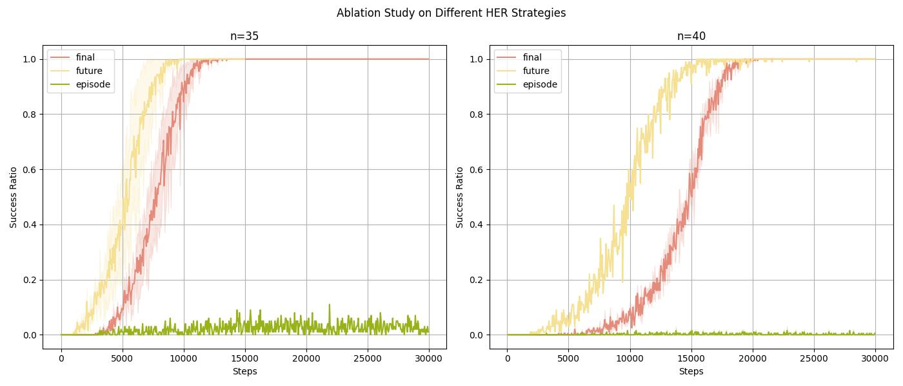

# Dealing with the Sparse Reward Problem in the Bit-Flipping Environment



## Getting started
The training environment (PyTorch and dependencies) can be installed as follows:
```bash
cd HER
conda activate -n her python=3.8
pip install -r requirements/requirements.txt
[optional]
pip install -r requirements/requirements-mujoco.txt
...
```

## Train
```bash
cd ~/slurm
chmod +x run_reward_shaping.sh
./run_reward_shaping.sh
```

```bash
python her.py --seed 12 --n_episode 300000 --n_bits 35 --device cuda:0 --her_strategy final
```
